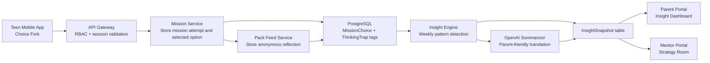

# EmpathiQ Architecture

## Monorepo Folder Structure

```text
empathiq/
├── apps/
│   ├── parent-portal/                # Next.js admin + parent + mentor + teen preview web app
│   ├── mentor-portal/                # Next.js mentor strategy room
│   └── teen-mobile/                  # React Native / Expo app
│       └── src/
│           └── features/
│               └── missions/
├── packages/
│   ├── database/
│   │   └── prisma/
│   ├── shared/                       # shared types, enums, contracts
│   └── ui/                           # cross-platform design tokens
├── services/
│   ├── api-gateway/                  # auth, RBAC, BFF endpoints
│   └── insight-engine/               # thinking trap analytics
├── docs/
└── package.json
```

## Product Surfaces

- Admin hub: operational control surface that can launch parent, mentor, and teen preview experiences from one UI.
- Teenager portal: mobile-first missions, anonymous pack reflections, sensory exercises.
- Parent portal: plain-language insights, activity suggestions, low-resolution progress trends.
- Mentor portal: richer pattern analytics, pack-level comparisons, and intervention planning.

## Web UI Structure

The current web app lives in [apps/parent-portal](/Users/mathewjose/Documents/empathiQ/apps/parent-portal) and now uses a more production-shaped layout:

- `app/_components/` holds reusable shell, hero, and card-grid components.
- `app/_data/portalData.ts` centralizes nav items, metrics, panels, and timeline content.
- `app/_data/workshopData.ts` now holds the admin workshop planner data extracted from the DOSE runbook and enriched for EmpathiQ.
- `app/api/*` exposes route handlers that return typed portal payloads.
- `app/_lib/portalApi.ts` is the server-side loader layer that can switch from local fallback data to real backend calls.
- `app/admin`, `app/admin/workshops/family-dose`, `app/parent`, `app/mentor`, and `app/teen-preview` expose the role-specific routes.

This keeps the route files thin and makes it easier to replace mock content with API data later without rewriting the page composition layer.

## Workshop Roadmap

The new workshop planning module is documented in [docs/workshop-roadmap.md](/Users/mathewjose/Documents/empathiQ/docs/workshop-roadmap.md).

It combines:
- the two-day DOSE family workshop structure from the provided runbook
- preventive REE or REBT and mindfulness ideas inspired by public AllzWellEver materials
- EmpathiQ-specific next steps around safety triage, parent follow-through, mentor review, and school bridge workflows

## Family Care Workflow

The next domain layer for real-world family cases is documented in [docs/family-care-workflow.md](/Users/mathewjose/Documents/empathiQ/docs/family-care-workflow.md).

It adds:
- family intake and household mapping
- crisis and safety triage
- caregiver wellness and conflict tracking
- academic pressure and routine modules
- referral and follow-up workflows

The first shared domain contracts for this are in [packages/shared/src/contracts/familyCare.ts](/Users/mathewjose/Documents/empathiQ/packages/shared/src/contracts/familyCare.ts).

## Pack Privacy Layer

The privacy-first Pack implementation and route design are documented in [docs/pack-privacy-api.md](/Users/mathewjose/Documents/empathiQ/docs/pack-privacy-api.md).

The shared request and response contracts live in [packages/shared/src/contracts/pack.ts](/Users/mathewjose/Documents/empathiQ/packages/shared/src/contracts/pack.ts).

## Core Domain Model

- `User` holds authentication identity and role.
- `TeenProfile`, `ParentProfile`, and `MentorProfile` store role-specific data.
- `ParentTeenLink` models family relationships with consent and guardianship metadata.
- `Pack` and `PackMembership` maintain closed peer cohorts of 6-8 teens.
- `Mission`, `MissionDecisionOption`, `MissionAttempt`, and `MissionChoice` capture mission flow and outcomes.
- `ThinkingTrap` and `MissionChoiceTrap` keep REBT-style tags explicit and queryable.
- `PackReflection` stores anonymous post-mission reflection posts.
- `InsightSnapshot` persists weekly summaries for mentor and parent dashboards.

## Pack Logic

The starter cohort assignment helper lives at [packages/shared/src/pack/assignToPack.ts](/Users/mathewjose/Documents/empathiQ/packages/shared/src/pack/assignToPack.ts).

- Packs stay closed and active in the 6-8 member range.
- Teen placement first filters by age band, then by matching support needs, then by lowest current member count.
- If no compatible active pack exists, the function returns `null` so a new cohort can be formed rather than overfilling or mis-grouping a teen.

## Prisma/PostgreSQL Schema

The schema lives at [packages/database/prisma/schema.prisma](/Users/mathewjose/Documents/empathiQ/packages/database/prisma/schema.prisma).

## High-Level System Design



## Data Flow Notes

1. A teen completes a mission branch and chooses a decision option.
2. The selected option carries one or more thinking trap tags such as `ACCURATE_THINKING` or `CATASTROPHIZING`.
3. The backend stores the attempt, ties it to the teen and mission, and updates the teen's pack feed if a reflection is posted.
4. The Insight Engine aggregates the last seven days of choices, ranks the most frequent trap patterns, and creates a weekly snapshot.
5. OpenAI translates technical trap labels into parent-safe language; mentors still receive structured raw pattern data.
6. Parents see broad themes and suggested offline activities, while mentors get deeper analysis and pack-level comparisons.
