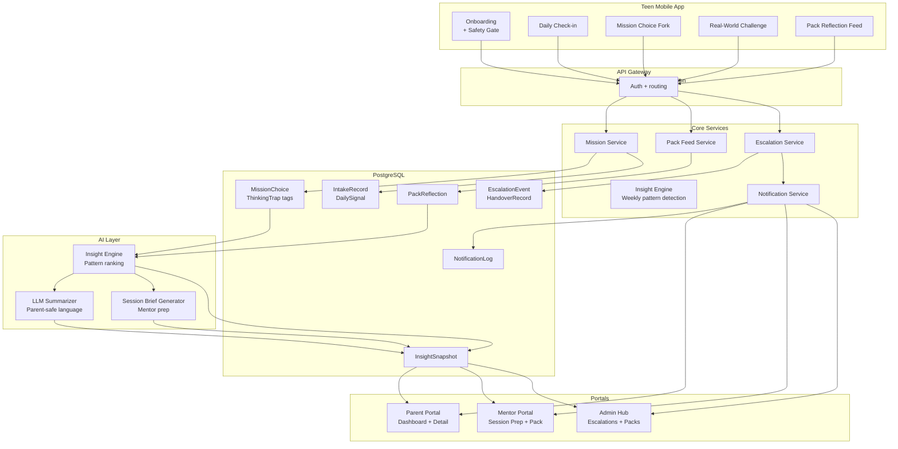

# EmpathyRise Architecture

> Updated to reflect wireframe review. Additions are marked **[added]**.

---

## Monorepo Folder Structure

```text
empathyrise/
├── apps/
│   ├── parent-portal/                # Next.js — admin + parent + mentor + teen preview
│   ├── mentor-portal/                # Next.js — mentor strategy room + session prep
│   └── teen-mobile/                  # React Native / Expo
│       └── src/
│           └── features/
│               ├── onboarding/       # [added] intake, safety gate, household mapping
│               ├── daily-checkin/    # [added] mood signal, arc progress, pack nudge
│               ├── missions/         # choice fork, arc progression, reflection
│               ├── challenges/       # [added] real-world challenge submission
│               └── pack/             # anonymous reflection feed, alumni pathway
├── packages/
│   ├── database/
│   │   └── prisma/
│   ├── shared/
│   │   └── src/
│   │       ├── contracts/
│   │       │   ├── familyCare.ts
│   │       │   ├── teenModule.ts
│   │       │   ├── pack.ts
│   │       │   ├── escalation.ts     # [added] EscalationEvent, TriageDecision, HandoverRecord
│   │       │   └── checkin.ts        # [added] DailySignal, MoodEntry, CheckinSummary
│   │       └── pack/
│   │           └── assignToPack.ts
│   └── ui/                           # cross-platform design tokens
├── services/
│   ├── api-gateway/                  # auth, RBAC, BFF endpoints
│   ├── insight-engine/               # thinking trap analytics, InsightSnapshot
│   ├── notification-service/         # [added] push, email, in-app alerts across roles
│   └── escalation-service/           # [added] triage logic, clinical handover workflow
├── docs/
│   ├── workshop-roadmap.md
│   ├── family-care-workflow.md
│   ├── teen-module-blueprint.md
│   ├── teen-module-execution-plan.md
│   ├── pack-privacy-api.md
│   └── escalation-protocol.md       # [added] scripted mentor language, contact sequence
└── package.json
```

---

## Product Surfaces

- **Admin hub** — operational control surface. Launches parent, mentor, and teen preview experiences. Manages pack formation queue, mentor training cohort progress, workshop planner, and live safety alert count.
- **Teen mobile app** — mobile-first. Onboarding intake, daily check-in, mission choice fork, anonymous pack reflection, real-world challenge submission. Works on low-spec Android on restricted bandwidth.
- **Parent portal** — plain-language progress dashboard, conversational toolkit, co-participation challenge invitations, progress detail view with thinking-trap frequency and mentor observation timeline.
- **Mentor portal** — AI-generated session prep brief, pack overview with member progress and anonymous reflection feed, session notes, safety flag controls, escalation checklist.

---

## Route Map

### Teen Mobile (`apps/teen-mobile`)

| Route | Screen | Notes |
|---|---|---|
| `/onboarding` | Intake + safety gate | Age band, primary concerns, 3-question safety screen, guardian consent |
| `/onboarding/household` | Household mapping | [added] caregiver type, home stability flag fed to mentor context |
| `/home` | Daily check-in | Mood signal, arc progress, pack nudge |
| `/missions` | Mission arc list | Arc status, locked/unlocked state |
| `/missions/:id` | Choice fork | Scenario, 3 options, consequence reveal, reflection question |
| `/missions/:id/reflect` | Post-mission reflection | Single question, anonymous pack share toggle |
| `/challenges/:id` | Real-world challenge | [added] Instructions, voice/text submission, offline tag |
| `/pack` | Pack reflection feed | Anonymous posts, "I felt this too" reaction |
| `/pack/alumni` | Alumni conversation | [added] Opt-in structured conversation with a programme graduate |
| `/progress` | Personal arc progress | Arc completion, thinking trap history |

### Parent Portal (`apps/parent-portal/app/parent`)

| Route | Screen |
|---|---|
| `/parent` | Dashboard — metrics, mentor note, co-participation invite |
| `/parent/progress` | Teen progress detail — trap frequency, mentor timeline |
| `/parent/toolkit` | Conversational toolkit — week-specific suggestions |
| `/parent/challenges` | Co-participation challenge view and acceptance |

### Mentor Portal (`apps/mentor-portal`)

| Route | Screen | Notes |
|---|---|---|
| `/mentor` | Session list — upcoming and past | |
| `/mentor/session/:id/prep` | Session prep brief | [added] AI brief: pattern summary, suggested focus, opening question |
| `/mentor/session/:id/notes` | Session notes + flag | Observation entry, positive shift / safety concern flags |
| `/mentor/pack/:id` | Pack overview | Member progress bars, anonymous reflection feed, cohesion indicator |
| `/mentor/pack/:id/formation` | Pack formation | [added] Admin-assisted assignment, age band matching |
| `/mentor/escalation/:id` | Escalation checklist | [added] Scripted language, contact sequence, incident documentation |

### Admin Hub (`apps/parent-portal/app/admin`)

| Route | Screen |
|---|---|
| `/admin` | Hub — metrics, launch-as, safety alert badge |
| `/admin/workshops/family-dose` | Workshop planner |
| `/admin/packs` | [added] Pack formation queue, assignment algorithm trigger |
| `/admin/mentors` | [added] Mentor training cohort progress, certification status |
| `/admin/escalations` | [added] All open and resolved escalation records |

---

## Web UI Structure

The web app lives in `apps/parent-portal` and uses a production-shaped layout:

- `app/_components/` — reusable shell, hero, and card-grid components.
- `app/_data/portalData.ts` — nav items, metrics, panels, and timeline content.
- `app/_data/workshopData.ts` — admin workshop planner data from the DOSE runbook.
- `app/_data/sessionPrepData.ts` — **[added]** AI brief payload shape for mentor session prep.
- `app/_data/escalationData.ts` — **[added]** EscalationEvent payload, checklist state, handover record.
- `app/api/*` — route handlers returning typed portal payloads.
- `app/_lib/portalApi.ts` — server-side loader, switches from mock to real backend.
- `app/_lib/escalationApi.ts` — **[added]** escalation state machine, checklist persistence.
- Role routes: `app/admin`, `app/admin/workshops/family-dose`, `app/admin/packs`, `app/admin/escalations`, `app/parent`, `app/mentor`, `app/mentor/session/[id]/prep`, `app/teen-preview`.

---

## Core Domain Model

### Existing models
- `User` — auth identity and role.
- `TeenProfile`, `ParentProfile`, `MentorProfile` — role-specific data.
- `ParentTeenLink` — family relationships with consent and guardianship metadata.
- `Pack`, `PackMembership` — closed peer cohorts of 6–8 teens.
- `Mission`, `MissionDecisionOption`, `MissionAttempt`, `MissionChoice` — mission flow and outcomes.
- `ThinkingTrap`, `MissionChoiceTrap` — REBT-style tags, explicit and queryable.
- `PackReflection` — anonymous post-mission reflection posts.
- `InsightSnapshot` — weekly summaries for mentor and parent dashboards.

### Added models [added]

- `IntakeRecord` — teen onboarding answers: age band, primary concerns, household type, caregiver stability flag.
- `SafetyGateResponse` — answers to the 3-question intake safety screen. Triggers triage if any response is flagged.
- `DailySignal` — mood entry, free-text note, arc position snapshot. One per teen per day.
- `ChallengeAttempt` — real-world challenge submission. Stores text or voice-note URL, linked to mission arc and teen.
- `EscalationEvent` — created when a mentor flags a clinical boundary crossing. Fields: severity (monitor / clinical-referral / emergency), disclosure summary, checklist state (JSON), clinical partner ID, resolved boolean.
- `TriageDecision` — mentor's severity assessment linked to an EscalationEvent.
- `HandoverRecord` — confirmation that clinical referral was accepted by a named clinical partner.
- `NotificationLog` — [added] records every push, email, and in-app alert sent across roles, with delivery status.
- `AlumniConversation` — [added] opt-in structured conversation request between current teen and programme graduate. Status: pending / scheduled / completed.

---

## Pack Logic

The cohort assignment helper lives at `packages/shared/src/pack/assignToPack.ts`.

- Packs stay closed and active in the 6–8 member range.
- Placement filters first by age band, then by matching support needs (from `IntakeRecord.primaryConcerns`), then by lowest current member count.
- If no compatible active pack exists, returns `null` — admin is prompted to form a new cohort.
- **[added]** Co-participation challenge safety gate: if `IntakeRecord.caregiverStabilityFlag` is true, family challenge missions are replaced with pack-based peer alternatives. The swap is transparent to the teen.

---

## Escalation Service [added]

Lives at `services/escalation-service/`.

The escalation service manages the state machine for any clinical boundary crossing identified by a mentor.

**States:** `OPENED → SUPERVISOR_NOTIFIED → PARENT_INFORMED → REFERRAL_SENT → REFERRAL_ACCEPTED → CLOSED`

**On open:**
1. `EscalationEvent` record created with severity, disclosure summary, and timestamp.
2. Notification sent to EmpathyRise supervisor (push + email).
3. Mentor portal loads escalation checklist with scripted language.
4. Regular mentoring session is locked for this student until the escalation is resolved.

**Scripted language store:** `services/escalation-service/scripts/` holds the exact language templates for what a mentor says to the student, what a mentor says when calling the parent, and what the referral letter contains. Templates are parameterised by severity level.

**Clinical partner registry:** `services/escalation-service/partners.ts` holds the list of clinical partners per geography with contact details and current availability status.

---

## Notification Service [added]

Lives at `services/notification-service/`.

Handles all cross-role communication. No direct push from insight engine to user — everything routes through here for logging and delivery confirmation.

| Trigger | Recipient | Channel |
|---|---|---|
| Mission arc completed | Parent | In-app + optional email |
| InsightSnapshot ready | Mentor | In-app |
| Session scheduled (T-24h) | Teen + Mentor | Push |
| Pack reflection posted | Pack members | In-app (batched, not real-time) |
| Co-participation challenge available | Parent | In-app |
| Safety gate flag raised | Supervisor | Push + email (immediate) |
| Escalation state change | Mentor + Supervisor | Push + email |
| Pack cohesion low | Mentor | In-app |
| Real-world challenge overdue | Teen | Push |

---

## High-Level System Design



---

## Data Flow Notes

1. A teen completes onboarding. `IntakeRecord` stores age band, primary concerns, and caregiver stability flag. If any safety gate answer is flagged, `SafetyGateResponse` triggers a triage review before the teen is placed in a pack.

2. Each day, the teen submits a `DailySignal` — mood, free-text note, current arc position. This feeds the mentor's session prep brief alongside mission data.

3. A teen completes a mission branch. The chosen `MissionDecisionOption` carries one or more `ThinkingTrap` tags such as `ACCURATE_THINKING` or `CATASTROPHIZING`. The backend stores the `MissionAttempt`, links it to the teen and mission, and updates the pack feed if a reflection is posted.

4. A teen submits a `ChallengeAttempt` for a real-world offline challenge. The submission (text or voice URL) is stored and included in the mentor's session prep brief for the next session.

5. The Insight Engine aggregates the last seven days of `MissionChoice` records and `DailySignal` entries, ranks the most frequent trap patterns, and creates a weekly `InsightSnapshot`.

6. The LLM Summarizer translates technical trap labels into parent-safe language and writes the conversational toolkit suggestion for the week. Mentors receive structured raw pattern data plus the AI-generated `SessionBrief` — pattern summary, suggested focus, one opening question drawn from the teen's own reflection language.

7. Parents see broad themes, progress trends, and the co-participation challenge invitation. Mentors see deeper pattern analysis, pack-level comparisons, and the session prep brief. All updates are routed through the Notification Service before reaching the portals.

8. If a mentor flags a clinical boundary crossing during a session, the Escalation Service creates an `EscalationEvent`, locks regular mentoring for that student, sends immediate alerts to the supervisor, and loads the scripted escalation checklist in the mentor portal. The checklist walks through each required step. The record is locked on completion and reviewed by the clinical advisory team.

---

## What Was Added vs Original Architecture

| Area | Status | Notes |
|---|---|---|
| Teen onboarding + intake | **Added** | `IntakeRecord`, `SafetyGateResponse`, `/onboarding` routes |
| Daily check-in signal | **Added** | `DailySignal`, `/home` route, feeds session prep |
| Mission choice fork UI | Existed in data model | Routes and screen design added |
| Real-world challenge submission | **Added** | `ChallengeAttempt`, `/challenges/:id` route |
| Mentor session prep brief | **Added** | `SessionBrief` from AI layer, `/mentor/session/:id/prep` route |
| Pack formation admin screen | **Added** | `/admin/packs` route, formation queue |
| Safety triage screen | **Added** | `TriageDecision`, triage UI in mentor portal |
| Escalation service + UI | **Added** | Full state machine, scripted language store, partner registry |
| Notification service | **Added** | Cross-role alerts, `NotificationLog`, delivery tracking |
| Alumni conversation | **Added** | `AlumniConversation`, `/pack/alumni` route |
| Co-participation safety gate | **Added** | Flag from `IntakeRecord` swaps family challenges for pack alternatives |

---

## Teen Web Experience [added]

The teen experience is fully implemented as a web-first route group inside `apps/parent-portal/app/teen/`. It runs independently of the parent/admin/mentor routes and has its own layout, design system, and state layer.

### Route Map

| Route | File | Description |
|---|---|---|
| `/teen` | `page.tsx` | Home: animated greeting, live XP count-up, vibe check, pulsing story card, quick links, avatar teaser |
| `/teen/onboarding` | `onboarding/page.tsx` | 4-step visual quiz — mood → concerns → safety gate → avatar intro |
| `/teen/mission/[slug]` | `mission/[slug]/page.tsx` | Full mission flow: story → choice → consequence → reflect → completion overlay |
| `/teen/stories` | `stories/page.tsx` | Browsable library of 15 mission stubs with category filter pills |
| `/teen/pack` | `pack/page.tsx` | Anonymous peer reflection feed, mood cloud, emoji reactions |
| `/teen/toolbox` | `toolbox/page.tsx` | 15 tools across 5 categories (Breathing, Grounding, Journaling, Movement, Social) |
| `/teen/me` | `me/page.tsx` | Avatar display, XP progress, stats, achievements, weekly streak calendar |
| `/teen/safety` | `safety/page.tsx` | Amber and crisis modes with verified Indian helplines |

### Design System

The teen section uses a fully custom CSS system (`teen.css`, ~700 lines) with CSS custom properties — **no Tailwind**. Key variables: `--teen-bg` (navy), `--teen-accent` (cyan), `--teen-purple`, `--teen-green`, `--teen-amber`, `--teen-rose`.

### Engagement Layer

Three-layer engagement system implemented to maximise session depth and daily return:

**Layer 1 — Story Hook (first 30 seconds)**
- XP number counts up from 0 on page load (ease-out cubic animation)
- Streak badge with flickering fire emoji animation
- Story card pulses with glow to draw CTA attention
- Social proof: live pack check-in count
- Vibe check is the first action — one tap, instant reward, unlocks matched story

**Layer 2 — Reading Flow (inside mission)**
- Narrative appears in 3 progressive text chunks; teen taps "Keep Reading →" for each
- Stage progress dots at top (● ● ○ ○) show position across 4 stages
- Sensory pause prompt only appears after all chunks are revealed
- Choice cards perform attention shake animation 2.5 seconds after appearing
- Thinking trap card pops in with scale animation 600ms after consequence text — reward moment
- "Continue to Reflection" button fades in only after trap is visible

**Layer 3 — Comeback Loop (return mechanics)**
- Completion overlay with avatar, gradient XP number, and navigation to pack feed
- Streak calendar on the Me page makes daily check-ins feel consequential
- Pack feed shows peer reflections with "12 teens checked in today" social pull
- Avatar evolves visibly at XP thresholds — identity investment across sessions
- "Next story" teaser and unlocked stories tally drive return

### Avatar Evolution

| Stage | Label | XP Threshold |
|---|---|---|
| 🌱 | SEEDLING | 0 |
| 🌿 | SPROUT | 500 |
| 🌳 | SAPLING | 1 000 |
| 🌲 | TREE | 2 500 |
| ✨ | RADIANT | 5 000 |

### Safety System

Safety gate in onboarding asks two questions (home safety + self-harm ideation). If flagged, teen routes to `/teen/safety` instead of home. Safety page has two modes: **Amber** (gentle check-in) and **Crisis** (immediate helplines). Helplines are India-specific and verified real numbers:
- TeleMANAS 14416 (toll-free, 24/7, Government of India)
- Vandrevala Foundation 9999 666 555 (24/7 WhatsApp)
- AASRA +91-22-2754 6669 (24/7)
- iCALL 022-2552 1111 (Mon–Sat, 8am–10pm IST)
