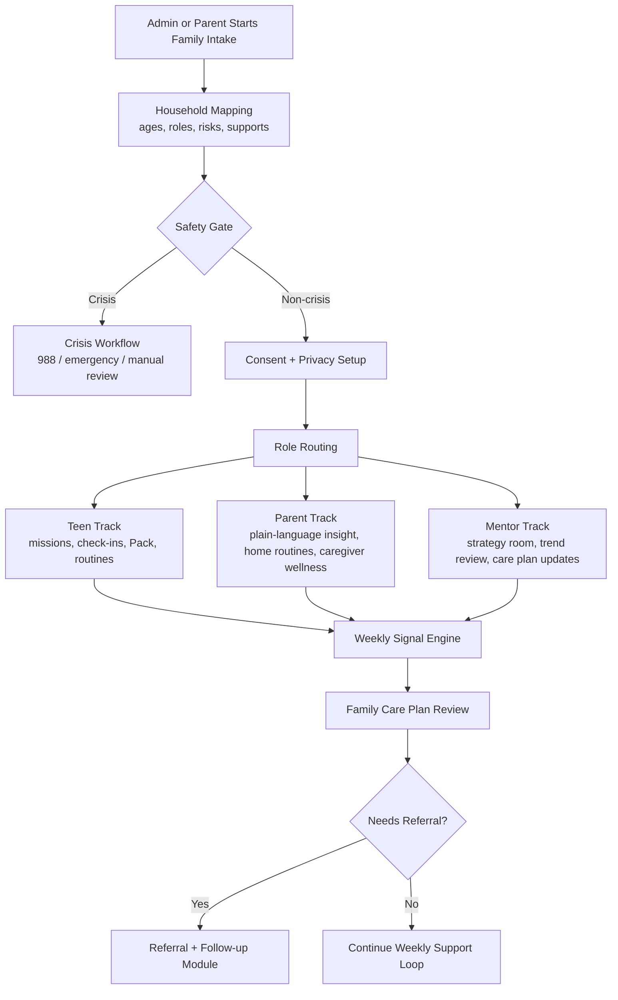

# EmpathiQ Family Care Workflow

This document turns EmpathiQ from a generic mentoring product into a workflow that can handle real family stressors that drive academic underperformance and emotional overload.

## Scope Guardrails

- EmpathiQ's core teen experience remains for ages 13-18.
- Family members aged 20, 21, 24, 25, and 28 from your examples should not enter the Teen Pack or teen missions.
- Children under 13 should not enter the Teen Pack either; they belong in parent-facing support and referral workflows only.
- The app should not diagnose or treat. It should identify risk, structure support, improve communication, and route families to licensed or emergency help when needed.

## Design Principles

- Safety first: self-harm, suicidal warning signs, intoxicated caregiving, violence risk, or acute substance crises must bypass normal engagement flows and trigger crisis routing. This is consistent with NIMH and SAMHSA crisis guidance.
- Protective factors over labels: the app should strengthen safe, stable, nurturing relationships, school connectedness, mentoring, routines, and caregiver support rather than only tagging problems. This matches CDC guidance on ACE prevention and school connectedness.
- Teen confidentiality with clear limits: the app should respect adolescent privacy for reflective work, while making exceptions for imminent safety concerns. This aligns with HHS adolescent confidentiality guidance and NIDA's note that parent involvement may be limited by confidentiality except in danger situations.
- Family systems view: we should never treat academic underperformance as an isolated student problem when caregiver mental health, substance use, conflict, separation, or unmet developmental needs are visible in the home.

## What the App Must Add

### 1. Family Intake Module

Purpose:
Capture household structure, caregiver functioning, school stress, routines, developmental concerns, and known support systems before a teen ever sees a mission.

Key fields:
- household members and ages
- caregiver mental health and substance use concerns
- conflict frequency and separation status
- child sleep, food, screen, school, peer, and counseling status
- current professionals already involved
- emergency contacts and crisis preference data

### 2. Safety and Crisis Module

Purpose:
Immediately separate normal mentoring from crisis cases.

Trigger examples:
- self-harm behavior
- suicidal warning signs
- severe aggression or unsafe home conflict
- intoxicated or impaired caregiver creating immediate safety concerns
- heavy substance use with acute risk

System behavior:
- show crisis-first UI instead of routine missions
- present emergency and crisis contacts
- notify admin or designated care coordinator
- pause gamified progression until manual review

### 3. Family Risk Stratification

Every family should be bucketed into one of four levels:
- `ROUTINE`: mild academic or emotional strain without active safety concerns
- `ELEVATED`: recurring family conflict, emerging substance use, screen overuse, or school disengagement
- `URGENT`: strong functional decline, repeated substance use, caregiver instability, or worsening emotional distress
- `CRISIS`: self-harm, suicidal warning signs, violence risk, acute intoxication, or immediate danger

## Real Application Flow

## Role-Based Workflow

### Admin / Care Coordinator

Owns:
- family intake completion
- safety triage
- referral coordination
- closing or escalating cases

Primary screens:
- Family Queue
- Risk Review Board
- Referral Tracker
- Household Timeline

### Parent Portal

Owns:
- caregiver check-ins
- home routine implementation
- school coordination tasks
- completion of offline "sideways invitations"

Primary modules:
- Parent Wellness Check
- Home Climate Check
- Routine Builder
- School Bridge
- Referral Follow-up

### Teen Portal

Owns:
- private emotional reflection
- narrative missions
- sleep, food, screen, and study check-ins
- mentor-supported weekly goals

Primary modules:
- Mission Hub
- Emotion and Thinking Pattern Check-in
- Routine Reset
- Connectedness Builder
- Anonymous Pack Reflection

### Mentor Portal

Owns:
- interpretation of weekly patterns
- plan adjustments
- identifying when a case no longer belongs in a mentoring-only workflow

Primary modules:
- Strategy Room
- Academic Stress Lens
- Family Climate Lens
- Referral Recommendation Console

## Problem-to-Module Mapping

### A. Caregiver mental health and household instability

Examples from your list:
- mother with depression and anxiety
- mother as psychiatric patient
- parents separated but not legally
- parents blaming each other

App response:
- Parent Wellness Check
- Home Climate Tracker
- Family Conflict journal in parent view
- Mentor visibility into household stress, but not private therapy details
- referral prompts to existing clinicians or mental health services

### B. Caregiver alcohol and substance use

Examples:
- father alcohol dependent and chain smoker
- both parents occasionally consuming alcohol
- father with alcohol and substance use concerns

App response:
- Household Safety Check
- caregiver substance-use screening prompt in parent/admin flow
- teen missions should focus on emotional overload and safe adult mapping, not confronting the parent directly
- mentor/admin gets referral and escalation prompts

### C. Self-harm and serious emotional distress

Examples:
- 14-year-old with self-harm and monthly counseling

App response:
- no standard Pack onboarding until risk review is complete
- crisis-aware teen check-in path
- safety-plan storage
- counseling coordination status
- faster review cadence and direct escalation path

### D. Screen overuse, routines, developmental and nutrition issues

Examples:
- Minecraft/Roblox addiction with poor academics
- excessive screen time and delayed speech
- YouTube overexposure
- poor diet, obesity concerns, low appetite

App response:
- Routine Reset module
- Digital Hygiene plan
- movement, sleep, and meal anchors
- developmental referrals where age-appropriate
- parent-focused daily routines for under-13 children

### E. Academic overload and expectations mismatch

Examples:
- excessive parental expectations
- heavy tuition load and boredom
- poor problem-solving and public speaking

App response:
- Academic Pressure module
- workload reflection missions for teens 13-18
- parent coaching around praise, pacing, and realistic expectations
- mentor strategy notes tied to school connectedness and study rhythm

### F. Substance use in adolescents and young adults

Examples:
- alcohol and weed use
- alcohol and drug addiction concerns

App response:
- for ages 13-17: validated screening should occur under clinical supervision, not as a self-diagnosis tool
- for ages 18+: keep these members outside the teen Pack and route through parent/admin or a separate young-adult service line
- mentor dashboard should show risk category and referral status, not raw confessions as social content

## Weekly Support Loop

### Teen weekly loop

1. Short emotional load check
2. Routine signals: sleep, food, screen, school effort
3. One narrative mission
4. One Pack reflection if safe and appropriate
5. Mentor review and next-step goal

### Parent weekly loop

1. Home climate check
2. Caregiver capacity check
3. One sideways invitation
4. One school or routine action
5. Review summary in plain language

### Mentor weekly loop

1. Review family risk changes
2. Check academic and emotional signals
3. Update support plan
4. Decide continue, intensify, or refer

## Data Model Additions Recommended

Add these entities on top of the current RBAC and mission schema:

- `Family`
- `FamilyMember`
- `FamilyIssue`
- `RiskFlag`
- `SafetyPlan`
- `CarePlan`
- `InterventionTask`
- `Referral`
- `SchoolSupportPlan`
- `RoutineCheckIn`
- `CareCoordinatorNote`

The first shared contracts for this workflow now live at [packages/shared/src/contracts/familyCare.ts](/Users/mathewjose/Documents/empathiQ/packages/shared/src/contracts/familyCare.ts).

## MVP Flow We Should Build First

Phase 1:
- Family Intake
- Safety and Crisis Gate
- Parent Wellness Check
- Teen Routine + Mission Check-in
- Mentor Risk Review
- Referral Tracker

Phase 2:
- School Bridge
- Care-plan tasks and reminders
- longitudinal family timeline

Phase 3:
- cohort analytics for admins
- provider handoff summaries
- outcomes reporting tied to attendance, routines, and emotional load

## Why This Fits the Evidence

- CDC emphasizes that adversity often comes from layered family, community, and relationship factors, and that prevention depends on safe, stable, nurturing relationships and environments.
- CDC also identifies school connectedness and supportive adult relationships as protective for both mental health and academic outcomes.
- NIMH and SAMHSA support crisis-first escalation when self-harm or suicide warning signs are present.
- HHS and NIDA support confidentiality-aware adolescent workflows, with safety exceptions and clinician-led substance-use screening.

## References

- CDC ACEs risk and protective factors: [https://www.cdc.gov/aces/risk-factors/index.html](https://www.cdc.gov/aces/risk-factors/index.html)
- CDC preventing ACEs: [https://www.cdc.gov/aces/prevention/index.html](https://www.cdc.gov/aces/prevention/index.html)
- CDC school connectedness: [https://www.cdc.gov/youth-behavior/school-connectedness/index.html](https://www.cdc.gov/youth-behavior/school-connectedness/index.html)
- CDC adolescent mental health: [https://www.cdc.gov/healthy-youth/mental-health/index.html](https://www.cdc.gov/healthy-youth/mental-health/index.html)
- NIMH suicide warning signs: [https://www.nimh.nih.gov/health/publications/warning-signs-of-suicide](https://www.nimh.nih.gov/health/publications/warning-signs-of-suicide)
- SAMHSA crisis help: [https://www.samhsa.gov/find-support/in-crisis](https://www.samhsa.gov/find-support/in-crisis)
- SAMHSA 988: [https://www.samhsa.gov/mental-health/988](https://www.samhsa.gov/mental-health/988)
- HHS OPA adolescent mental health access: [https://opa.hhs.gov/adolescent-health/mental-health-adolescents/access-adolescent-mental-health-care](https://opa.hhs.gov/adolescent-health/mental-health-adolescents/access-adolescent-mental-health-care)
- HHS OPA adolescent confidentiality context: [https://opa.hhs.gov/adolescent-health/physical-health-developing-adolescents/clinical-preventive-services/learning-use](https://opa.hhs.gov/adolescent-health/physical-health-developing-adolescents/clinical-preventive-services/learning-use)
- NIDA adolescent substance-use screening tools: [https://nida.nih.gov/nidamed-medical-health-professionals/screening-tools-prevention/screening-tools-adolescent-substance-use/adolescent-substance-use-screening-tools](https://nida.nih.gov/nidamed-medical-health-professionals/screening-tools-prevention/screening-tools-adolescent-substance-use/adolescent-substance-use-screening-tools)
